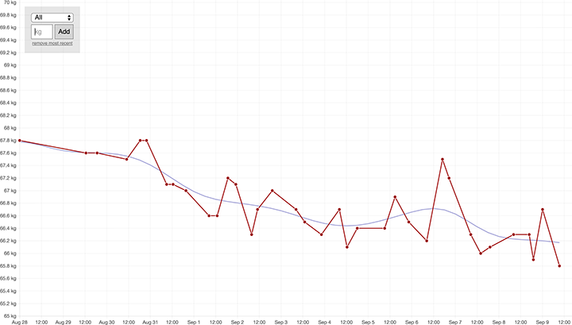

# leichter

A bare-bones weight tracking app with a simple and responsive web interface. "Leichter" is German for *lighter*, which is about as imaginative a name as I was able to come up with in a minute.

## Installation
1. [Make sure](http://stackoverflow.com/questions/1066521/php-with-sqlite3-support) to install on a webserver with PHP and SQLite3 support
2. Access `reset.php` in a browser, type "yes" and press enter to set up the database
2. Go to `index.php` and start tracking your weight!

Note that the [license](https://github.com/doersino/leichter/blob/master/LICENSE) does not apply to files in `lib/`, those come with their own licenses.
